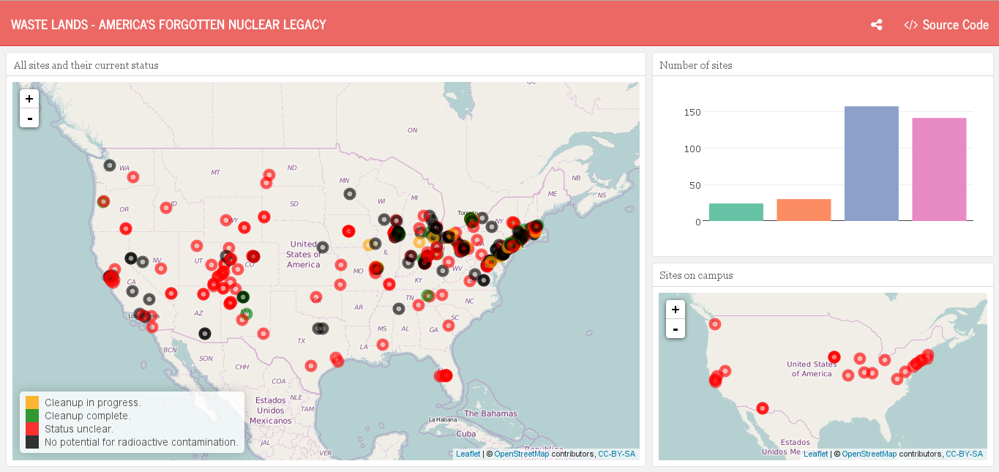

## First of all ...

Week 3 of @hrbrmstr's #dataviz challenge gets to an end. In the meantime the winners of the first two weeks have been chosen. 
While I am quite busy with my own #52Vis contribution and setting up some kind of blog post week for week, @hrbrmster takes the trouble to set up blog posts containing every single contribution as well as a short text on each. As announced on Twitter @hrbrmstr currently constructs [52vis.com](www.52vis.com) which will (probably) deal as a home for #52Vis. **For all this effort**, and I allow myself to speak for all participants, **many thanks!**

## Week 3 - Waste Lands

This week's dataset was extracted by @hrbrmstr himself from a WSJ story called *"Waste Lands: America’s Forgotten Nuclear Legacy"*. The WSJ summarizes:

> During the build-up to the Cold War, the U.S. government called upon hundreds of factories and research centers to help develop nuclear weapons and other forms of atomic energy. At many sites, this work left behind residual radioactive contamination requiring government cleanups, some of which are still going on.
The Department of Energy says it has protected the public health, and studies about radiation harm aren’t definitive. But with the government's own records about many of the sites unclear, the Journal has compiled a database that draws on thousands of public records and other sources to trace this historic atomic development effort and its consequences.

Besides the dataset that comes with this weeks challenge a lot more data is available from the DOE providing deeper insight into each site.

## Web scraping - my personal wasteland...

As I read through @hrbrmstr's announcement for this week's contest I was super euphoric: Many ideas came to my mind how and what to visualize and I saw a chance for me to get a bit deeper into web scraping (with R and `rvest`) - the many hints @hrbrmstr gave seemed to make this an ease.

But I soon had to face reality...

Though I'm principally able to get some data from a website using `rvest` I really struggled to get the data for all considered sites. At least not in a shape I could have cleaned up before driving me nuts... In the end it really got on my nerves and I decided to leave it be a get along with the less exciting dataset @hrbrmstr gave to us...

But I just hope that the other participants had more success and similar ideas as I had. I will marvel at your work and hopefully see how it is done! You live and learn.

## detach("package:rvest"), library(flexdashboard)

While I had to discard `rvest` I decided to try out some other stuff I haven't worked with yet (often): `flexdashboard`, `leaflet` and `plotly`.

* `flexdashboard` allows you to create interactive dashboard using R Markdown (super easy)
* `leaflet` is based on a JS library for interactive maps and well integrated in R
* `plotly` is also based on a JS library and is a top choice for all kinds of interactive graphs

Without the additional information from the DOE there's not much left to play with... So I decided to orient myself by the original WSJ vis. 

I used `leaflet` to plot the location of all sites (given that information was available) and colored the markers depending on the current status of each site (just like WSJ did).

To really make use of `flexdashboard` I had to come with some more. What you don't see well on the map is how many sites actually do have an unclear status and how few sites are declared cleaned up. So I made a simple bar plot with `plotly` which shows status and counts when hovering over the bars.

Another `leaflet`graph finishes my dashboard: Some sites are clearly related to an University. You find them by looking for certain keywords in the site's name or address. I don't know how to think about potentially contaminated areas on campus...

**The dashboard is published on RPubs [here](http://rpubs.com/ottlngr/172202).** Below is a screenshot:

## Concluding words

`flexdashboard` is a super cool thing! It looks great, is easy to use and works with quite anything you can get out of R. There are more features that I have not used for my dashboard (like multiple pages) but I changed the theme, added a *social* button and a button that should either open the embedded source code or a link to the source code - unluckily that does not work so far... [^1]

`plotly` is great and I think I'll use it more often. But maybe more in a `ggplotly()` way than in a `plot_ly` way.

`leaflet` was fun to use, but I think in most cases a non-interactive map does the job as well. I guess it's more useful when working with city or street maps with more details.

[^1]: Source code can be found here: 
